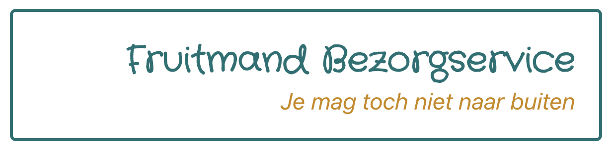

# Opdrachtbeschrijving

## Inleiding
Je vrienden Freek en Bernard zijn allebei doorgewinterde horeca-toppers, maar vanwege de wereldwijde pandemie zijn zij helaas hun baan kwijtgeraakt. Gelukkig zijn Freek en Bernard niet voor één gat te vangen, dus zijn ze samen een bedrijfje begonnen:

Zelf vraag je je af of het slim was om Bernards 9-jarige nichtje het logo te laten ontwerpen, maar dat terzijde. Je bent allang blij dat ze iets te doen hebben. Daarom wil je ze natuurlijk een handje helpen door een online bestelformulier voor ze te maken!

## Applicatie starten
Als je het project gecloned hebt naar jouw locale machine, installeer je eerst de `node_modules` door het volgende commando in de terminal te runnen:

`npm install`

Wanneer dit klaar is, kun je de applicatie starten met behulp van:

`npm start`

of gebruik de WebStorm knop (npm start). Open http://localhost:3000 om de pagina in de browser te bekijken. Begin met het maken van wijzigingen in `src/App.js`: elke keer als je een bestand opslaat, zullen de wijzigingen te zien zijn op de webpagina.

## Opdracht 1 - State
Gebruikers gaan zelf aan de slag met het samenstellen van hun fruitmand. Ze hebben de keuze tussen vier typen fruit waarvan ze de aantallen mogen bepalen:

Zoals je ziet is de styling niet belangrijk, focus je in eerste instantie op de functionaliteit. Heb je tijd over? Kijk dan vooral bij de bonusopdrachten!

### Randvoorwaarden fruit-counters
* Je maakt gebruik van de useState hook van React om de hoeveelheden bij te houden
* Klanten hebben de vrijheid om te kiezen tussen vier typen fruit:
  1. Bananen 🍌
  2. Aarbeien 🍓
  3. Appels 🍏
  4. Kiwi's 🥝
* Elk type fruit heeft twee buttons: één die de hoeveelheid verhoogd (`+`) en één die de hoeveelheid verlaagd (`-`)
* De hoeveelheid mag door de gebruiker niet lager gezet worden dan 0
* De hoeveelheid geselecteerde fruittypes wordt bij iedere update getoond aan de gebruiker
* Er is ook een reset button, die alle counters weer op 0 zet.

## Opdracht 2 - Formulier bouwen
Het is natuurlijk lastig om een fruitmand te bestellen als we niet weten waar die mand naartoe moet. Daarom gaan we een bestelformulier maken:

Zoals je ziet is de styling niet belangrijk, focus je in eerste instantie op de functionaliteit. Heb je tijd over? Kijk dan vooral bij de bonusopdrachten!

### Randvoorwaarden formulier
* Het formulier bevat de volgende velden:
  * Voornaam
  * Achternaam
  * Leeftijd
  * Postcode
  * Selectbox met bezorgfrequentie. _Opties_: iedere week, om de week, iedere maand
  * Radiobuttons met tijdvak. _Opties_: overdag, 's avonds
  * Opmerking (textarea)
  * Akkoord met de voorwaarden (checkbox)
  * Verzendbutton
* Pas wanneer de gebruiker op verzenden drukt, worden de formulier-waardes én de fruit-waardes in de console gelogd!

## Opdracht 3 - Componenten maken
Maak eigen componenten van elementen die je heel veel hebt hergebruikt. Om dit voor elkaar te krijgen zul je de state moeten bijhouden in `App.js` en zowel waardes als functies door moeten geven als properties _(callback props)_. Denk hierbij aan:
* De reset- en verzenden button (die lijken erg op elkaar, toch?)
* De - counter + combinatie
* De label- en text-input combinatie
* Ga zo maar door!

## Bonus opdrachten
* Maak er een mooie gestylde pagina van!
* Gebruik één samengestelde `onChange` handler-functie voor alle fruitsoorten samen
* En als je dan toch bezig bent, voorzie dan de buttons van conditionele styling. Wanneer een fruitsoort 1 of meer keer aangeklikt is, kun je 'm bijvoorbeeld een gekleurde rand geven!